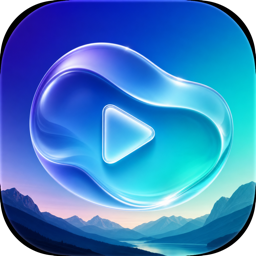

<p align="center">
  
</p>

<h1 align="center">LiquidWall</h1>

<p align="center">
  Fondos de pantalla en vivo (vídeo y foto) para macOS con interfaz Liquid Glass nativa.
</p>

<p align="center">
  <a href="README.md">English</a> ·
  <a href="README.ru.md">Русский</a> ·
  <a href="README.zh-Hans.md">简体中文</a> ·
  <a href="README.ja.md">日本語</a> ·
  <a href="README.de.md">Deutsch</a> ·
  <strong>Español</strong> ·
  <a href="README.pt-BR.md">Português (Brasil)</a> ·
  <a href="README.fr.md">Français</a> ·
  <a href="README.ko.md">한국어</a> ·
  <a href="README.pl.md">Polski</a>
</p>

<p align="center">
  
  
  
</p>

---

Alternativa ligera a Wallpaper Engine para Mac. Convierte cualquier vídeo o imagen
en fondo de escritorio, con galería [Pixabay](https://pixabay.com) integrada:
buscar, previsualizar y aplicar con un clic.

## Características

- **Fondos de vídeo y foto** — MP4/MOV en bucle continuo o imágenes estáticas
- **Varias pantallas** — principal (predeterminado), todas o una específica
- **Galería Pixabay** — miles de vídeos y fotos gratis, scroll infinito,
  vista previa en streaming, descargas paralelas con progreso
- **Pestaña Biblioteca** — volver a aplicar o eliminar medios descargados
- **Arrastrar y soltar** — suelta un archivo local en la tarjeta de vista previa
- **10 idiomas** — selector en la app (inglés, ruso, chino, japonés, alemán,
  español, portugués, francés, coreano, polaco) más Sistema; la ayuda y
  la búsqueda Pixabay siguen el idioma elegido
- **Eficiencia energética** — decodificación por hardware (~2–3 % CPU en 1080p),
  pausa automática al cubrir el escritorio, bloquear pantalla o dormir
- **Iniciar al iniciar sesión** — opcional en ajustes
- **UI Liquid Glass nativa** — SwiftUI en macOS Tahoe

## Instalación

1. Descarga el último `.dmg` en [Releases](https://github.com/daifoll/LiquidWall/releases)
2. Ábrelo y arrastra **LiquidWall** a **Aplicaciones**
3. En el primer inicio, Gatekeeper avisará. **Ajustes del sistema → Privacidad y seguridad → Abrir de todos modos**, o:

```bash
xattr -d com.apple.quarantine /Applications/LiquidWall.app
```

> Requiere **macOS Tahoe (26.0) o posterior**.

## Clave API de Pixabay

La galería necesita una clave API gratuita de Pixabay (dos minutos):

1. Regístrate en [pixabay.com](https://pixabay.com/accounts/register/)
2. Abre la [documentación API](https://pixabay.com/api/docs/) — la clave está junto a `key`
3. Pégala en la app cuando se solicite

## Compilar desde el código

Requiere Xcode 26+ (Swift 6.2+).

```bash
./build.sh
open build/LiquidWall.app
```

Empaquetar DMG ([dmgbuild](https://github.com/dmgbuild/dmgbuild), `pip3 install dmgbuild`):

```bash
./package.sh
```

## Limitaciones

- El fondo no se ve sobre apps a pantalla completa
- Fotos Pixabay limitadas a 1280 px sin cuenta API aprobada; vídeos sin límite

## Traducciones

README disponible en 10 idiomas — enlaces arriba.

> **Nota:** las traducciones de la interfaz y del README se generaron con IA y pueden
> contener imprecisiones. Abre un issue o pull request si encuentras un error.

## Créditos

- Medios de [Pixabay](https://pixabay.com) (Pixabay Content License)
- Creado por [daifoll](https://github.com/daifoll)
- Desarrollo asistido por IA con **Fable 5** en [Cursor](https://cursor.com)

## Licencia

[MIT](LICENSE)
